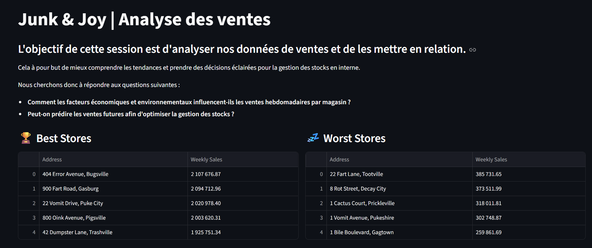
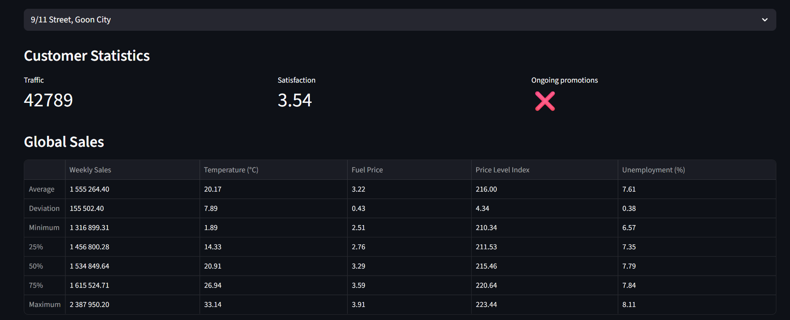
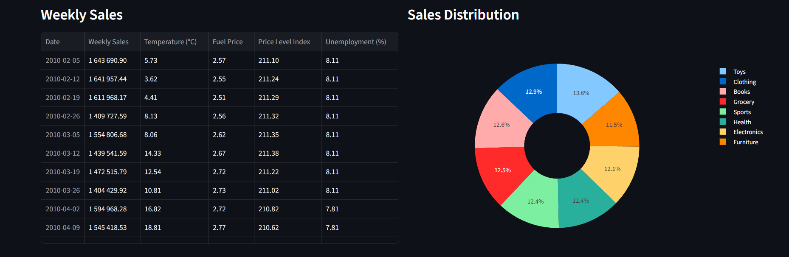
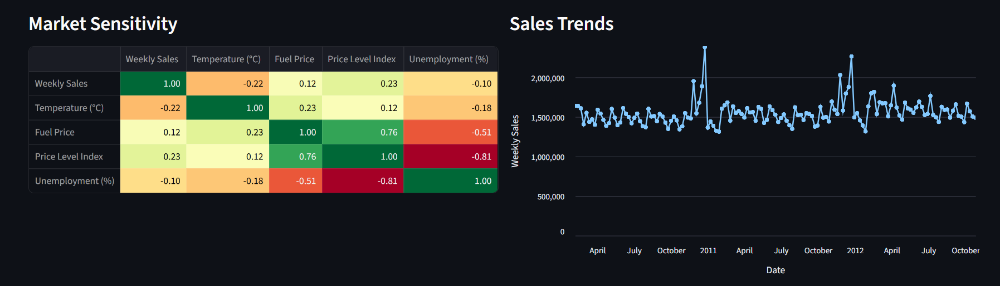

# Data_Analyse

## Introduction

pour cet exercice, nous devions réaliser une analyse détaillée à l'aide de data d'un sujet choisi par notre équipe. Nous utiliserons le langage Python et les bibliothèques streamlit, Pandas et numpy pour réaliser une interface d'expertise des Data fournie par le site Kaggle

nos problematique sont:
-  Comment les facteurs économiques et environnementaux influencent-ils les ventes hebdomadaires par magasin ? 

- Peut-on prédire les ventes futures afin d'optimiser la gestion des stocks ?

## Kaggle link

[Kaggle.com](https://www.kaggle.com/datasets) 

    

nous avons utilisé les data Set fourni par le site Kaggle pour résoudre notre problématique et la lier à notre environnement visuel StreamLit

## StreamLit

[Streamlit Doc](vhttps://docs.streamlit.io/)

    

streamLit est une bibliothèque graphique nous permettant de visualiser des data set ici la synthèse faite par Panda est illustrée via un ensemble de critères et de graphes, ce qui nous donne ce résultat

## Resulta

    
    
    
    

